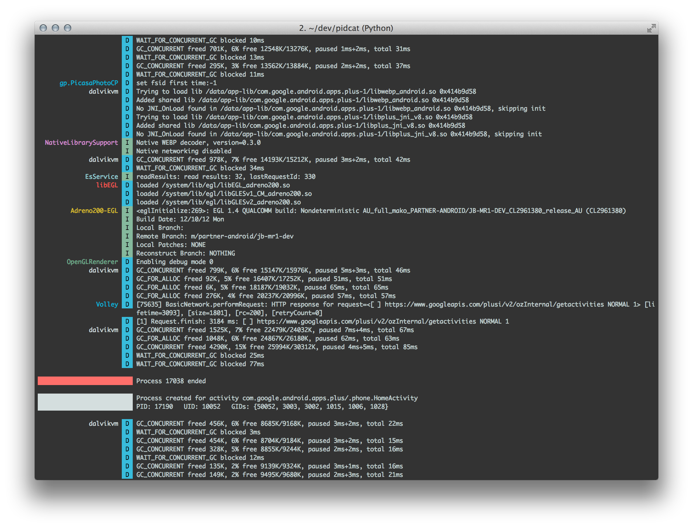

PID Cat
=======

An update to Jeff Sharkey's excellent [logcat color script][1] which only shows
log entries for processes from a specific application package.

During application development you often want to only display log messages
coming from your app. Unfortunately, because the process ID changes every time
you deploy to the phone it becomes a challenge to grep for the right thing.

This script solves that problem by filtering by application package. Supply the
target package as the sole argument to the python script and enjoy a more
convenient development process.

    pidcat com.oprah.bees.android


Here is an example of the output when running for the Google Plus app:




Install
-------

Get the script:

 *  OS X: Use [Homebrew][2].

         brew install pidcat

    If you need to install the latest development version

        brew unlink pidcat
        brew install --HEAD pidcat

 * Arch Linux : Install the package called `pidcat-git` from the [AUR][4].

 * Others: Download the `pidcat.py` and place it on your PATH.


Make sure that `adb` from the [Android SDK][3] is on your PATH. This script will
not work unless this is that case. That means, when you type `adb` and press
enter into your terminal something actually happens.

To include `adb` and other android tools on your path:

    export PATH=$PATH:<path to Android SDK>/platform-tools
    export PATH=$PATH:<path to Android SDK>/tools

Include these lines in your `.bashrc` or `.zshrc`.

*Note:* `<path to Android SDK>` should be absolute and not relative.

`pidcat` requires at least version 8.30 of `coreutils`. Ubuntu 20.04 LTS already ships
with it, for 18.04 and below, `coreutils` can be upgraded from the `focal` repo by running
the following:

```shell
sudo add-apt-repository 'deb http://archive.ubuntu.com/ubuntu focal main restricted universe multiverse'
sudo apt-get update
sudo apt-get -t focal install coreutils
```

 [1]: http://jsharkey.org/blog/2009/04/22/modifying-the-android-logcat-stream-for-full-color-debugging/
 [2]: http://brew.sh
 [3]: http://developer.android.com/sdk/
 [4]: https://aur.archlinux.org/packages/pidcat-git/
